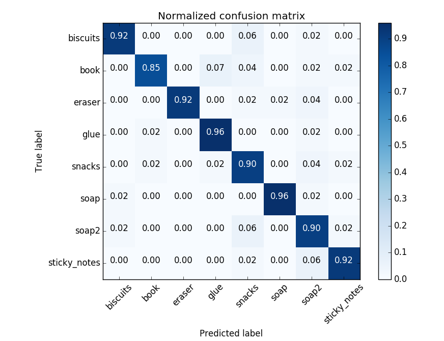
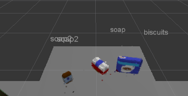
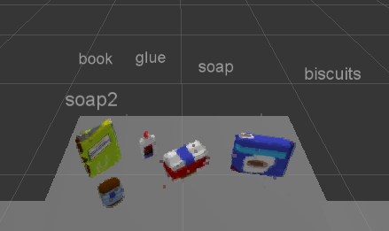
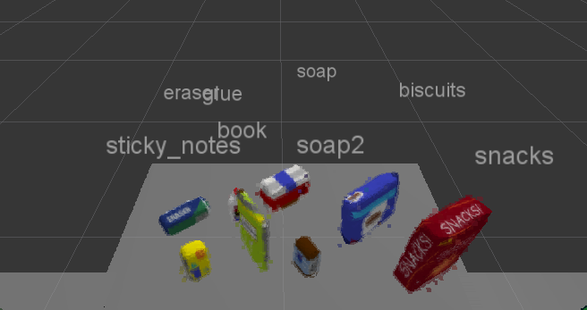

[](https://www.udacity.com/robotics)
# Project: Perception Pick & Place

---

## Index

### 1. - Required steps to complete this project:
### 2. - Code detail:
### 3. - Running environment:
### 4. - Test results:
### 5. - Project discussion:

---

## 1. Required steps to complete this project:
1. Extract features and train an SVM model on new objects (see `pick_list_*.yaml` in `/pr2_robot/config/` for the list of models you'll be trying to identify). 
2. Write a ROS node and subscribe to `/pr2/world/points` topic. This topic contains noisy point cloud data that you must work with.
3. Use filtering and RANSAC plane fitting to isolate the objects of interest from the rest of the scene.
4. Apply Euclidean clustering to create separate clusters for individual items.
5. Perform object recognition on these objects and assign them labels (markers in RViz).
6. Calculate the centroid (average in x, y and z) of the set of points belonging to that each object.
7. Create ROS messages containing the details of each object (name, pick_pose, etc.) and write these messages out to `.yaml` files, one for each of the 3 scenarios (`test1-3.world` in `/pr2_robot/worlds/`).  See the example `output.yaml` for details on what the output should look like.  
8. Submit a link to your GitHub repo for the project or the Python code for your perception pipeline and your output `.yaml` files (3 `.yaml` files, one for each test world).  You must have correctly identified 100% of objects from `pick_list_1.yaml` for `test1.world`, 80% of items from `pick_list_2.yaml` for `test2.world` and 75% of items from `pick_list_3.yaml` in `test3.world`.


---

## 2. Code detail:
### The add new codes in project_template.py

#### The codes are implemented in Exercise-1 and 2, and copied to project_template.py in RoboND-Perception-Project/pr2_robot/scripts folder
```
    # Convert ROS msg to PCL data
    cloud = ros_to_pcl(pcl_msg)
    
    # Apply Statistical Outlier Filtering
    outlier_filter = cloud.make_statistical_outlier_filter()

    # Set the number of neighboring points to analyze for any given point
    outlier_filter.set_mean_k(50)

    # Set threshold scale factor
    x = 1.0   # need to test different values

    # Any point with a mean distance larger than global (mean distance+x*std_dev) will be considered outlier
    outlier_filter.set_std_dev_mul_thresh(x)

    # Finally call the filter function for magic
    cloud_filtered = outlier_filter.filter()

    # Apply Voxel Grid Downsampling
    vox = cloud_filtered.make_voxel_grid_filter()
    LEAF_SIZE = 0.01
    vox.set_leaf_size(LEAF_SIZE, LEAF_SIZE, LEAF_SIZE)
    cloud_filtered = vox.filter()

    # Apply PassThrough Filter
    passthrough = cloud_filtered.make_passthrough_filter()
    filter_axis = 'z'
    passthrough.set_filter_field_name (filter_axis)
    axis_min = 0.6
    axis_max = 1.1
    passthrough.set_filter_limits (axis_min, axis_max)
    cloud_filtered = passthrough.filter()

    passthrough = cloud_filtered.make_passthrough_filter()
    filter_axis = 'y'
    passthrough.set_filter_field_name (filter_axis)
    axis_min = -0.4
    axis_max = 0.4
    passthrough.set_filter_limits (axis_min, axis_max)
    cloud_filtered = passthrough.filter()

    # Apply RANSAC Plane Segmentation
    seg = cloud_filtered.make_segmenter()
    seg.set_model_type(pcl.SACMODEL_PLANE)
    seg.set_method_type(pcl.SAC_RANSAC)
    max_distance = 0.01
    seg.set_distance_threshold(max_distance)
    inliers, coefficients = seg.segment()

    # Extract inliers and outliers
    cloud_table = cloud_filtered.extract(inliers, negative=False)   # table
    cloud_objects = cloud_filtered.extract(inliers, negative=True)   # object

    # Apply Euclidean Clustering
    white_cloud = XYZRGB_to_XYZ(cloud_objects)
    tree = white_cloud.make_kdtree()
    # Create a cluster extraction object
    ec = white_cloud.make_EuclideanClusterExtraction()
    # Set tolerances for distance threshold 
    # as well as minimum and maximum cluster size (in points)
    # NOTE: These are poor choices of clustering parameters
    # Your task is to experiment and find values that work for segmenting objects.
    ec.set_ClusterTolerance(0.02)
    ec.set_MinClusterSize(80)
    ec.set_MaxClusterSize(1600)
    # Search the k-d tree for clusters
    ec.set_SearchMethod(tree)
    # Extract indices for each of the discovered clusters
    cluster_indices = ec.Extract()

    # Create Cluster-Mask Point Cloud to visualize each cluster separately
    #Assign a color corresponding to each segmented object in scene
    cluster_color = get_color_list(len(cluster_indices))

    color_cluster_point_list = []

    for j, indices in enumerate(cluster_indices):
        for i, indice in enumerate(indices):
            color_cluster_point_list.append([white_cloud[indice][0],
                                        white_cloud[indice][1],
                                        white_cloud[indice][2],
                                         rgb_to_float(cluster_color[j])])

    # Create new cloud containing all clusters, each with unique color
    cluster_cloud = pcl.PointCloud_PointXYZRGB()
    cluster_cloud.from_list(color_cluster_point_list)

    # Convert PCL data to ROS messages
    ros_cloud_objects =  pcl_to_ros(cloud_objects)
    ros_cloud_table = pcl_to_ros(cloud_table)
    ros_cluster_cloud = pcl_to_ros(cluster_cloud)

    # Publish ROS messages
    pcl_objects_pub.publish(ros_cloud_objects)
    pcl_table_pub.publish(ros_cloud_table)
    pcl_cluster_pub.publish(ros_cluster_cloud)

```

#### The codes are implemented in Exercise-3, and copied to project_template.py in RoboND-Perception-Project/pr2_robot/scripts folder
```
    # Classify the clusters! (loop through each detected cluster one at a time)
    for index, pts_list in enumerate(cluster_indices):

        # Grab the points for the cluster
        pcl_cluster = cloud_objects.extract(pts_list)

        # Convert the cluster from pcl to ROS using helper function
        ros_cluster = pcl_to_ros(pcl_cluster)

        # Compute the associated feature vector
        # Extract histogram features
        # Complete this step just as is covered in capture_features.py
        chists = compute_color_histograms(ros_cluster, using_hsv=True)
        normals = get_normals(ros_cluster)
        nhists = compute_normal_histograms(normals)
        feature = np.concatenate((chists, nhists))

        # Make the prediction
        # and add it to detected_objects_labels list
        prediction = clf.predict(scaler.transform(feature.reshape(1,-1)))
        label = encoder.inverse_transform(prediction)[0]
        detected_objects_labels.append(label)
        #print("label = %s" % label)

        # Publish a label into RViz
        label_pos = list(white_cloud[pts_list[0]])
        label_pos[2] += .4
        #print("label position = %s", label_pos)
        object_markers_pub.publish(make_label(label,label_pos, index))

        # Add the detected object to the list of detected objects.
        do = DetectedObject()
        do.label = label
        do.cloud = ros_cluster
        detected_objects.append(do)

    rospy.loginfo('Detected {} objects: {}'.format(len(detected_objects_labels), detected_objects_labels))

    # Publish the list of detected objects

    for obj in detected_objects:
        labels.append(obj.label)
        points_arr = ros_to_pcl(obj.cloud).to_array()
        centroids.append(np.mean(points_arr, axis=0)[:3])

    # Create a detected objects list that will be passed in pr2_mover(detected_objects_list) function
    detected_objects_list = dict(zip(labels, centroids))
```

### add compute_color_histograms() and compute_normal_histograms() functions in features.py in /sensor_stick/src/sensor_stick folder
```
def compute_color_histograms(cloud, using_hsv=False, nbins=32, bins_range=(0, 256)):

    # Compute histograms for the clusters
    point_colors_list = []

    # Step through each point in the point cloud
    for point in pc2.read_points(cloud, skip_nans=True):
        rgb_list = float_to_rgb(point[3])
        if using_hsv:
            point_colors_list.append(rgb_to_hsv(rgb_list) * 255)
        else:
            point_colors_list.append(rgb_list)

    # Populate lists with color values
    channel_1_vals = []
    channel_2_vals = []
    channel_3_vals = []

    for color in point_colors_list:
        channel_1_vals.append(color[0])
        channel_2_vals.append(color[1])
        channel_3_vals.append(color[2])
    
    # Compute histograms
    h_hist = np.histogram(channel_1_vals, bins=nbins, range=bins_range)
    s_hist = np.histogram(channel_2_vals, bins=nbins, range=bins_range)
    v_hist = np.histogram(channel_3_vals, bins=nbins, range=bins_range)

    # Concatenate and normalize the histograms
    hist_features = np.concatenate((h_hist[0], s_hist[0], v_hist[0])) * 1.0
    normed_features = hist_features / np.sum(hist_features)

    return normed_features 


def compute_normal_histograms(normal_cloud, nbins=32, bins_range=(0, 256)):
    norm_x_vals = []
    norm_y_vals = []
    norm_z_vals = []

    for norm_component in pc2.read_points(normal_cloud,
                                          field_names = ('normal_x', 'normal_y', 'normal_z'),
                                          skip_nans=True):
        norm_x_vals.append(norm_component[0])
        norm_y_vals.append(norm_component[1])
        norm_z_vals.append(norm_component[2])

    # Compute histograms of normal values (just like with color)
    h_hist = np.histogram(norm_x_vals, bins=nbins, range=bins_range)
    s_hist = np.histogram(norm_y_vals, bins=nbins, range=bins_range)
    v_hist = np.histogram(norm_z_vals, bins=nbins, range=bins_range)

    # Concatenate and normalize the histograms
    hist_features = np.concatenate((h_hist[0], s_hist[0], v_hist[0])) * 1.0
    normed_features = hist_features / np.sum(hist_features)

    # Generate random features for demo mode.  
    # Replace normed_features with your feature vector
    #normed_features = np.random.random(96)

    return normed_features
```

### modified SVM parameters in train_svm.py in /sensor_stick/scripts folder
```
# Create classifier
# Use linear kernel and set C parameter as 1.0
clf = svm.SVC(kernel='linear', C=1.0)
```

### modified capture_features.py file in sensor_stick/scripts folder
```
   models = [\
       'biscuits',
       'book',
       'snacks',
       'eraser',
       'glue',
       'sticky_notes',
       'soap',
       'soap2']
```

### modified pick_place_project.launch file in RoboND-Perception-Project/pr2_robot/launch folder, add these lines

    <!--Add a new arg for test_scene_number-->
    <!--Usage: test_scene_number:=1 or 2 or 3-->
    <arg name="test_scene_num"/>

    <!--Change the world name to load different tabletop setup depending on new arg-->
    <arg name="world_name" value="$(find pr2_robot)/worlds/test$(arg test_scene_num).world"/>

    <!--Change the list name based on the scene you have loaded-->
    <param name="test_scene_num" type="int" value="$(arg test_scene_num)"/>
    <rosparam command="load" file="$(find pr2_robot)/config/pick_list_$(arg test_scene_num).yaml"/>

### project file folder structure
```
Root path: RoboND-Perception-Project
                  |
                  +-- pr2_robot
                         |
                         |-- config   # store different config files 
                         |
                         |-- include # store all header files
                         |
                         |-- launch  # store all launch files              
                         |
                         |-- materials # store all graphic image feature files
                         |
                         |-- meshes # store different meshes files
                         |
                         |-- models # store different model files 
                         |
                         |-- output    # new folder to store all output yaml files 
                         |
                         |-- scripts # store different code files
                         |
                         |-- src   # store all c++ code files              
                         |
                         |-- srv  # store all srv files 
                         |
                         |-- training   # new folder to store all training sav files 
                         |
                         +-- world   # store all world files 
```

---

## 3. Running environment:
### Training process
Open a new ROS terminal and run this command to start Gazebo and RViz windows
```
   roslaunch sensor_stick training.launch
```

Open another new ROS terminal and run this command to capture object features
```
   rosrun sensor_stick capture_features.py under RoboND-Perception-Project/pr2_robot/training folder
```
Adjust the number of test data for each object (50) in capture_features.py to get a higher accuracy number.

Run SVM model code 

Result is:

    Features in Training Set: 400
    Invalid Features in Training set: 4
    SVC
    Scores: [ 0.9875      0.88607595  0.91139241  0.88607595  0.91139241]
    Accuracy: 0.92 (+/- 0.07)
    accuracy score: 0.916666666667



## 4. Test results:
### Run three test cases summary
    100% of objects from pick_list_1.yaml for test1.world (3/3), 
    80% of items from pick_list_2.yaml for test2.world (4/5).
    87.5% of items from pick_list_3.yaml in test3.world (7/8).
#### Test case 1:  
Run two commands:
```
    roslaunch pr2_robot pick_place_project.launch test_scene_num:=1
  
    rosrun pr2_robot project_template.py under RoboND-Perception-Project/pr2_robot folder in another terminal
```

#### Result: 3 objects are picked up in 3 objects
#### Output data in yaml file: output_1.yaml under Udacity-RoboND-Perception-Project/pr2_robot/output/
```
object_list:
- arm_name: right
  object_name: biscuits
  pick_pose:
    orientation:
      w: 0.0
      x: 0.0
      y: 0.0
      z: 0.0
    position:
      x: 0.542164146900177
      y: -0.24244220554828644
      z: 0.7056819200515747
  place_pose:
    orientation:
      w: 0.0
      x: 0.0
      y: 0.0
      z: 0.0
    position:
      x: 0
      y: -0.71
      z: 0.605
  test_scene_num: 1
- arm_name: right
  object_name: soap
  pick_pose:
    orientation:
      w: 0.0
      x: 0.0
      y: 0.0
      z: 0.0
    position:
      x: 0.5434764623641968
      y: -0.01946290209889412
      z: 0.6749463677406311
  place_pose:
    orientation:
      w: 0.0
      x: 0.0
      y: 0.0
      z: 0.0
    position:
      x: 0
      y: -0.71
      z: 0.605
  test_scene_num: 1
- arm_name: left
  object_name: soap2
  pick_pose:
    orientation:
      w: 0.0
      x: 0.0
      y: 0.0
      z: 0.0
    position:
      x: 0.44685181975364685
      y: 0.21615397930145264
      z: 0.6745059490203857
  place_pose:
    orientation:
      w: 0.0
      x: 0.0
      y: 0.0
      z: 0.0
    position:
      x: 0
      y: 0.71
      z: 0.605
  test_scene_num: 1
```

#### Test case 2:  
Run two commands:
```
    roslaunch pr2_robot pick_place_project.launch test_scene_num:=2
  
    rosrun pr2_robot project_template.py under RoboND-Perception-Project/pr2_robot folder in another terminal
```

#### Result: 4 objects are picked up in 5 objects
#### Output data in yaml file: output_2.yaml under Udacity-RoboND-Perception-Project/pr2_robot/output/
```
object_list:
- arm_name: right
  object_name: biscuits
  pick_pose:
    orientation:
      w: 0.0
      x: 0.0
      y: 0.0
      z: 0.0
    position:
      x: 0.5716290473937988
      y: -0.24809011816978455
      z: 0.7048883438110352
  place_pose:
    orientation:
      w: 0.0
      x: 0.0
      y: 0.0
      z: 0.0
    position:
      x: 0
      y: -0.71
      z: 0.605
  test_scene_num: 2
- arm_name: right
  object_name: soap
  pick_pose:
    orientation:
      w: 0.0
      x: 0.0
      y: 0.0
      z: 0.0
    position:
      x: 0.5612798929214478
      y: 0.0029581175185739994
      z: 0.67566978931427
  place_pose:
    orientation:
      w: 0.0
      x: 0.0
      y: 0.0
      z: 0.0
    position:
      x: 0
      y: -0.71
      z: 0.605
  test_scene_num: 2
- arm_name: left
  object_name: soap2
  pick_pose:
    orientation:
      w: 0.0
      x: 0.0
      y: 0.0
      z: 0.0
    position:
      x: 0.4449383616447449
      y: 0.22701767086982727
      z: 0.6768869161605835
  place_pose:
    orientation:
      w: 0.0
      x: 0.0
      y: 0.0
      z: 0.0
    position:
      x: 0
      y: 0.71
      z: 0.605
  test_scene_num: 2
- arm_name: left
  object_name: glue
  pick_pose:
    orientation:
      w: 0.0
      x: 0.0
      y: 0.0
      z: 0.0
    position:
      x: 0.6314414739608765
      y: 0.13117220997810364
      z: 0.6792183518409729
  place_pose:
    orientation:
      w: 0.0
      x: 0.0
      y: 0.0
      z: 0.0
    position:
      x: 0
      y: 0.71
      z: 0.605
  test_scene_num: 2
```

#### Test case 3:  
Run two commands:
```
    roslaunch pr2_robot pick_place_project.launch test_scene_num:=3
  
    rosrun pr2_robot project_template.py under RoboND-Perception-Project/pr2_robot folder in another terminal
```

#### Result: 7 objects are picked up in 8 objects
#### Output data in yaml file: output_3.yaml under Udacity-RoboND-Perception-Project/pr2_robot/output/
```
object_list:
- arm_name: left
  object_name: sticky_notes
  pick_pose:
    orientation:
      w: 0.0
      x: 0.0
      y: 0.0
      z: 0.0
    position:
      x: 0.4392457902431488
      y: 0.21652483940124512
      z: 0.6820456385612488
  place_pose:
    orientation:
      w: 0.0
      x: 0.0
      y: 0.0
      z: 0.0
    position:
      x: 0
      y: 0.71
      z: 0.605
  test_scene_num: 3
- arm_name: left
  object_name: book
  pick_pose:
    orientation:
      w: 0.0
      x: 0.0
      y: 0.0
      z: 0.0
    position:
      x: 0.4925742745399475
      y: 0.08357211202383041
      z: 0.7268510460853577
  place_pose:
    orientation:
      w: 0.0
      x: 0.0
      y: 0.0
      z: 0.0
    position:
      x: 0
      y: 0.71
      z: 0.605
  test_scene_num: 3
- arm_name: right
  object_name: snacks
  pick_pose:
    orientation:
      w: 0.0
      x: 0.0
      y: 0.0
      z: 0.0
    position:
      x: 0.4247541129589081
      y: -0.32465672492980957
      z: 0.7492871284484863
  place_pose:
    orientation:
      w: 0.0
      x: 0.0
      y: 0.0
      z: 0.0
    position:
      x: 0
      y: -0.71
      z: 0.605
  test_scene_num: 3
- arm_name: right
  object_name: biscuits
  pick_pose:
    orientation:
      w: 0.0
      x: 0.0
      y: 0.0
      z: 0.0
    position:
      x: 0.5893439054489136
      y: -0.21864846348762512
      z: 0.7051478624343872
  place_pose:
    orientation:
      w: 0.0
      x: 0.0
      y: 0.0
      z: 0.0
    position:
      x: 0
      y: -0.71
      z: 0.605
  test_scene_num: 3
- arm_name: left
  object_name: eraser
  pick_pose:
    orientation:
      w: 0.0
      x: 0.0
      y: 0.0
      z: 0.0
    position:
      x: 0.6074087619781494
      y: 0.28299638628959656
      z: 0.6464701294898987
  place_pose:
    orientation:
      w: 0.0
      x: 0.0
      y: 0.0
      z: 0.0
    position:
      x: 0
      y: 0.71
      z: 0.605
  test_scene_num: 3
- arm_name: right
  object_name: soap2
  pick_pose:
    orientation:
      w: 0.0
      x: 0.0
      y: 0.0
      z: 0.0
    position:
      x: 0.45494475960731506
      y: -0.043963149189949036
      z: 0.6764019131660461
  place_pose:
    orientation:
      w: 0.0
      x: 0.0
      y: 0.0
      z: 0.0
    position:
      x: 0
      y: -0.71
      z: 0.605
  test_scene_num: 3
- arm_name: right
  object_name: soap
  pick_pose:
    orientation:
      w: 0.0
      x: 0.0
      y: 0.0
      z: 0.0
    position:
      x: 0.6791621446609497
      y: 0.004758806899189949
      z: 0.6750279664993286
  place_pose:
    orientation:
      w: 0.0
      x: 0.0
      y: 0.0
      z: 0.0
    position:
      x: 0
      y: -0.71
      z: 0.605
  test_scene_num: 3
```
---

## 5. Project discussion:

### Filter parameter adjust
1. Statistical Outlier Filtering: Filtering the graphics noise

2. K-means Clustering: Grouping objects by clustering all closer dataset points together depends on final clustering number K. Set K = 16

3. VoxelGrid Downsampling Filter: Leaf Size as each voxel size, a big Leaf Size number can reduce more data size, but lose more detail. A small Leaf Size number can reduce less data size, but more processing power. It depends on input data to find the best balance. Set Leaf Size = 0.01

4. Passthrough Filter: It has filter_axis, axis_min, axis_max 3 parameters, I use this filter to crop z and y axis with specific region to remove none interest data.

5. RANSAC: Use RANSAC algorithm to separate inliers and outliers model based on the max_distance, Set max_distance = 0.01

6. Extract inliers and outliers: Use extract function to separate inliers and outliers objects.

7. Euclidean Clustering: Grouping objects by clustering all closer dataset points together. Create new point clouds containing the table and objects separately. Set 
```
    ec.set_ClusterTolerance(0.02)
    ec.set_MinClusterSize(80)
    ec.set_MaxClusterSize(1600)
```
### SVM parameter selection
1. svm.SVC(kernel='linear', C=1.0, gamma='auto')
```
Features in Training Set: 240
Invalid Features in Training set: 0
SVC
kernel= linear, C= 1.000000, gamma= auto
Scores: [ 0.89583333  0.875       0.91666667  0.83333333  0.875     ]
Accuracy: 0.88 (+/- 0.06)
accuracy score: 0.879166666667
```

2. svm.SVC(kernel='rbf', C=100, gamma='auto')
```
Features in Training Set: 240
Invalid Features in Training set: 0
SVC
kernel= rbf, C= 100.000000, gamma= auto
Scores: [ 0.89583333  0.875       0.89583333  0.91666667  0.91666667]
Accuracy: 0.90 (+/- 0.03)
accuracy score: 0.9
``` 
Using same capture feature dataset, set parameters as kernel= rbf, C= 100.000000, gamma= auto, the accuracy is better than set parameter as kernel= linear, C= 1.000000, gamma= auto. But when using SVM model in pick and place robot project.
The lower accuracy model got better recognized objects result.

### Improvement
Need to spend more time to understand filter and model algorithm and parameters, and tune up to get the best results.


